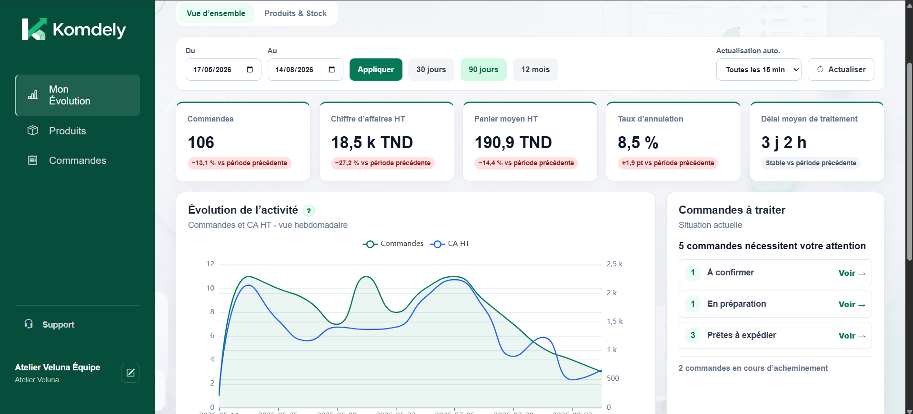
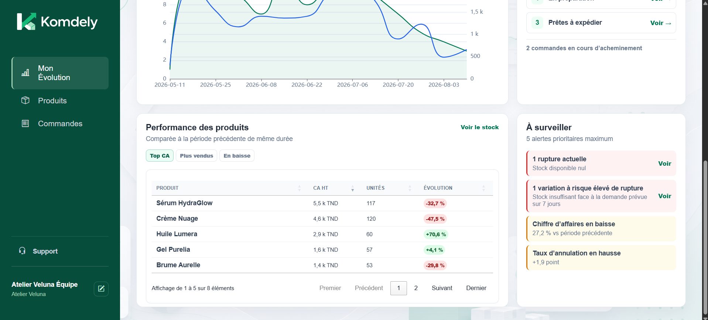
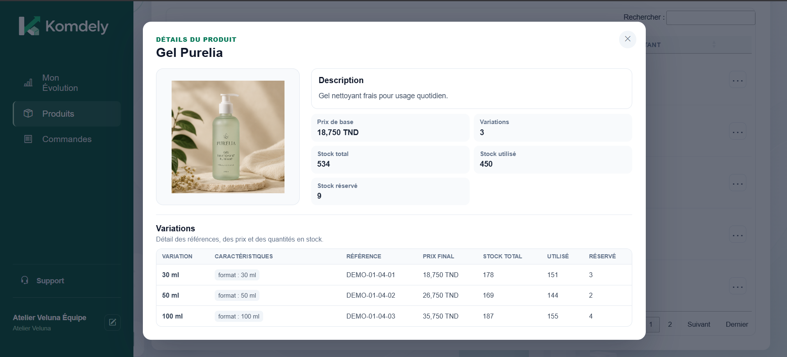
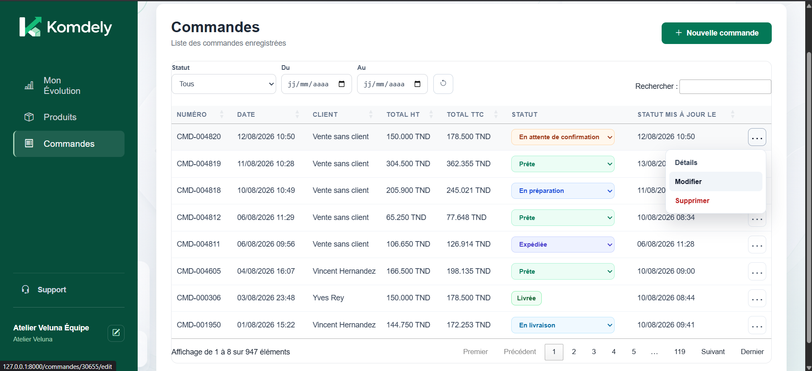
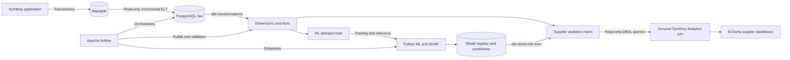
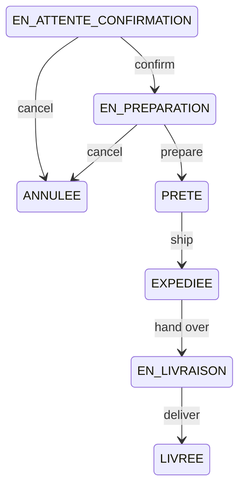

<p align="center">
  
</p>

<h1 align="center">Komdely</h1>

<p align="center">
  A multi-supplier order, product and inventory management platform enhanced with a modern analytics stack and explainable demand forecasting.
</p>

<p align="center">
  
  
  
  
  
  
</p>

Komdely is a portfolio-grade information system that manages the operational lifecycle of supplier orders and turns transactional data into actionable insights. It combines a Symfony business application, auditable inventory operations, a PostgreSQL data warehouse, automated ELT and dbt transformations, Airflow orchestration, supplier-scoped dashboards, and explainable machine learning for stock-risk anticipation.

## Product preview

<p align="center">
  
</p>

<details>
  <summary><strong>View more application screenshots</strong></summary>
  <br>
  <p align="center">
    
  </p>
  <p align="center"><em>Product performance and prioritized business alerts</em></p>
  <br>
  <p align="center">
    
  </p>
  <p align="center"><em>Product details, variations, pricing and stock allocation</em></p>
  <br>
  <p align="center">
    
  </p>
  <p align="center"><em>Server-side order management with controlled status transitions</em></p>
</details>

## Why this project stands out

- **End-to-end business workflow:** products, variations, optional customers, multi-line orders, status transitions, stock reservations, physical exits, returns and replenishments.
- **Auditable inventory:** every stock operation is handled by a dedicated business service and recorded with before/after physical and reserved quantities.
- **Multi-supplier security:** suppliers only access their own operational and analytical data; the browser never selects the supplier ID used by analytics queries.
- **Decision-oriented dashboard:** period comparisons, revenue and order trends, processing time, actionable order queues, product performance and stock-risk monitoring.
- **Complete data platform:** MariaDB -> Python ELT -> PostgreSQL -> dbt -> Airflow -> secured Symfony API -> ECharts.
- **Operational ML with XAI:** intermittent-demand forecasting, conservative q90 estimates, deterministic risk rules, recommendations and offline SHAP explanations translated into business language.
- **Reproducible engineering:** deterministic demo data, idempotent loads, versioned schemas, automated tests and GitHub Actions CI.

## System architecture



MariaDB remains the operational source of truth. Analytics and ML workloads run against a separate PostgreSQL warehouse, preventing reporting workloads from interfering with business transactions.

## Business capabilities

### Products and inventory

- Standard products and products with multiple variations.
- Variation-level references, prices, attributes and inventory.
- Registered, used, reserved, physical and available stock.
- Replenishment, reservation, reservation release, order exit, return and adjustment movements.
- Logical deletion that preserves historical consistency.
- Product detail views, large image previews and variation-level stock monitoring.

Available stock follows the same rule throughout Symfony, dbt and ML inference:

```text
available stock = max(0, registered stock - used stock - reserved stock)
```

### Orders

- Orders containing one or more products and variations.
- Optional customer details for in-store, phone or externally sourced orders.
- Historical unit prices and VAT preserved on order lines.
- Server-side stock validation before an order is accepted.
- Status history with actor and timestamp traceability.
- A4 delivery notes and 100 x 150 mm parcel labels generated as PDFs.
- Server-side DataTables for scalable filtering, ordering and pagination.

The Symfony Workflow component enforces the order lifecycle:



Stock is reserved for active orders, released when an eligible order is cancelled, and converted into a physical exit at the appropriate workflow transition.

## Analytics and data warehouse

The warehouse uses a layered architecture:

| Layer | Responsibility |
|---|---|
| `raw` | Source-preserving and idempotent MariaDB copies with extraction metadata |
| `staging` | Normalized names, types, dates, decimals and booleans |
| `analytics` | Star-schema dimensions, facts, dashboard marts and ML marts |
| `meta` | ELT watermarks, run history and Airflow pipeline auditing |
| `ml` | Versioned model registry and stock predictions |

### Star schema

Dimensions:

- `dim_date`
- `dim_supplier`
- `dim_client`
- `dim_product`
- `dim_variation`

Facts:

- `fact_order_line`, one row per order line
- `fact_stock_movement`, one row per inventory movement
- `fact_order_status_history`, one row per status transition

Specialized marts provide daily KPIs, product performance, current order workload, processing times, inventory state and predicted stock risk. Every mart exposed to Symfony retains the natural MariaDB supplier key so authorization can be enforced on every query.

The Python ELT package is incremental, batched and idempotent. It preserves source identifiers, records runs in `meta.etl_run`, maintains watermarks, handles logical deletions and records failures without presenting an incomplete refresh as successful.

## Dashboard and secured analytics API

The dashboard is designed as an operational decision tool rather than a collection of unrelated charts. It includes:

- order count, revenue, average basket, cancellation rate and processing-time KPIs;
- comparison with the previous period of equal duration;
- adaptive daily, weekly or monthly activity trends;
- current orders requiring supplier action;
- product rankings and declining performance;
- stock availability, current stockouts and predicted risks;
- loading, empty, error, retry and last-successful-refresh states;
- responsive ECharts visualizations and server-side DataTables.

The backend keeps a strict separation of responsibilities:

```text
Controller -> SupplierAnalyticsService -> SupplierAnalyticsRepository
           -> PostgreSQL DW -> DTO/JSON -> dashboard
```

The supplier ID is derived exclusively from the authenticated Symfony user. It is never accepted as a free browser parameter. The analytics connection uses Doctrine DBAL and warehouse tables are not mapped as ORM entities.

## Machine learning and explainability

The ML dataset has a daily grain of one date x supplier x variation and explicitly includes zero-demand days. Cancelled orders are excluded, no future dates are allowed, and current stock is deliberately excluded from model features to avoid learning constrained sales as true demand.

The reproducible benchmark compares:

1. a seven-day seasonal baseline;
2. Croston-SBA for intermittent demand;
3. a global `HistGradientBoostingRegressor`, including a q90 quantile model.

The selected operational bundle uses Croston-SBA for the central seven-day forecast and HistGradientBoosting q90 for a conservative demand bound. Features include leakage-safe lags, rolling statistics, recent trend, calendar seasonality and intermittency indicators. Every rolling feature applies `shift(1)` before computation.

Risk classification is deterministic and transparent:

```text
HIGH              available stock < central forecast
MEDIUM            central forecast <= available stock < q90 forecast
LOW               available stock >= q90 forecast
INSUFFICIENT_DATA fewer than 28 history days or fewer than 2 non-zero demand days

recommended quantity = max(0, ceil(q90 forecast - available stock))
```

Predictions are stored idempotently in PostgreSQL and never update operational stock. SHAP contributions are calculated outside web requests, limited to the three most influential logical features, and translated by Symfony into cautious business explanations. A feature is described as contributing to a prediction, never as causing a stockout.

> Results obtained on synthetic data do not guarantee equivalent performance on real demand.

## Technology stack

| Area | Technologies |
|---|---|
| Backend | PHP 8.2+, Symfony 7.4, Doctrine ORM/DBAL, Symfony Workflow |
| Operational database | MariaDB 10.4 |
| Frontend | Twig, JavaScript, jQuery, DataTables, ECharts 5.6.1, Bootstrap Icons |
| Documents | Dompdf |
| Data warehouse | PostgreSQL 16, dimensional modeling |
| Data integration | Python 3.11, SQLAlchemy, PyMySQL, psycopg |
| Transformations | dbt PostgreSQL |
| Orchestration | Apache Airflow 3.1.8, LocalExecutor, Docker Compose |
| Machine learning | pandas, NumPy, scikit-learn, Croston-SBA, SHAP, joblib |
| Quality | PHPUnit 11, pytest, dbt tests, Symfony linters, GitHub Actions |

## Repository structure

```text
.
|-- src/                         Symfony controllers, entities, repositories and services
|-- templates/                   Twig application and PDF templates
|-- public/                      JavaScript, CSS, images and uploaded assets
|-- config/                      Symfony, Doctrine, Workflow and demo configuration
|-- migrations/                  MariaDB Doctrine migrations
|-- tests/                       Symfony unit, service and functional tests
|-- data-platform/
|   |-- elt/                     MariaDB to PostgreSQL Python ELT package
|   |-- dbt/comdely_warehouse/   Staging, dimensions, facts, marts and data tests
|   |-- airflow/                 Dockerized orchestration and versioned DAGs
|   |-- ml/                      Feature engineering, benchmark, training, inference and XAI
|   |-- postgres/                DW initialization, security and ML schema migrations
|   `-- docs/                    Data model and architecture documentation
`-- .github/workflows/           Continuous integration
```

## Local setup

### Prerequisites

- PHP 8.2 or newer and Composer 2
- MariaDB 10.4 compatible server
- Symfony CLI
- Docker Desktop for PostgreSQL and Airflow
- Python 3.11 for local data-platform development

### Symfony application

```powershell
composer install
Copy-Item .env .env.local
```

Configure `DATABASE_URL` and `DW_DATABASE_URL` in `.env.local`, then prepare the operational database:

```powershell
php bin/console doctrine:database:create --if-not-exists
php bin/console doctrine:migrations:migrate --no-interaction
php bin/console doctrine:schema:validate
symfony server:start
```

### Data warehouse and Airflow

```powershell
Copy-Item data-platform/airflow/.env.example data-platform/airflow/.env
composer app:start
```

Component-specific documentation:

- [Data platform overview](data-platform/README.md)
- [Warehouse model](data-platform/docs/dw-model.md)
- [Python ELT](data-platform/elt/README.md)
- [dbt project](data-platform/dbt/comdely_warehouse/README.md)
- [Airflow orchestration](data-platform/airflow/README.md)
- [Machine learning](data-platform/ml/README.md)

## Reproducible demo data

Komdely includes a deterministic generator that reuses the real Workflow and inventory services. It refuses to run in production, marks generated records, avoids duplicate batches and only removes demo records when `--reset-demo` is requested.

Preview the medium dataset without writing to MariaDB:

```powershell
php bin/console app:generate-demo-data --seed=20260804 --start-date=2024-08-04 --end-date=2026-08-04 --scale=medium --dry-run
```

Generate a small validation dataset:

```powershell
php bin/console app:generate-demo-data --seed=20260804 --start-date=2024-08-04 --end-date=2026-08-04 --scale=small --reset-demo
```

Generate the medium analytics dataset:

```powershell
php bin/console app:generate-demo-data --seed=20260804 --start-date=2024-08-04 --end-date=2026-08-04 --scale=medium --reset-demo
```

The medium profile creates approximately 5 suppliers, 40 products, 120 variations, 200 synthetic customers and 4,800 orders over 24 months. It includes seasonality, intermittent demand, cancellations, processing delays, stockouts, replenishments, reservations, releases, exits, returns and adjustments.

Simulate a finite batch of recent activity:

```powershell
php bin/console app:simulate-live-activity --orders=10 --status-updates=10 --seed=20260810 --dry-run
php bin/console app:simulate-live-activity --orders=10 --status-updates=10 --seed=20260810
```

All generated customers use fictitious identities, plausible Tunisian addresses and reserved `demo.comdely.test` email addresses. No real personal information is used.

## Quality checks

```powershell
composer test
php bin/console lint:container
php bin/console lint:yaml config
php bin/console lint:twig templates
php bin/console doctrine:schema:validate
```

Python and dbt components include tests for configuration, transformations, grains, relationships, accepted values, temporal leakage, idempotence, reconciliation and supplier isolation. GitHub Actions validates Composer, Symfony configuration, Doctrine migrations and the PHP test suite on every pull request and push to `main`.

## Security and data protection

- Role-based access for administrators and suppliers.
- Supplier ownership enforced server-side for products, orders, documents and analytics.
- Read-only source sessions for ELT and a dedicated read-only PostgreSQL analytics user.
- No warehouse entity exposed through Doctrine ORM.
- Logical deletion preserving business history.
- Password hashes excluded from the warehouse raw layer.
- Customer details excluded from supplier KPI responses.
- Secrets and local environment files ignored by Git.
- ML recommendations never triggering automatic inventory changes.

## License

This repository is a portfolio and educational project. The source code is currently marked as proprietary; reuse or redistribution requires the author's permission.

Demo product photos are provided by Pexels when the optional image downloader is used.
